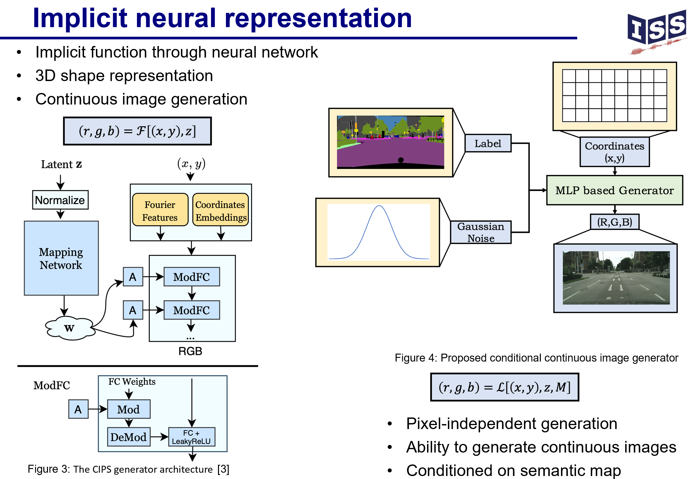
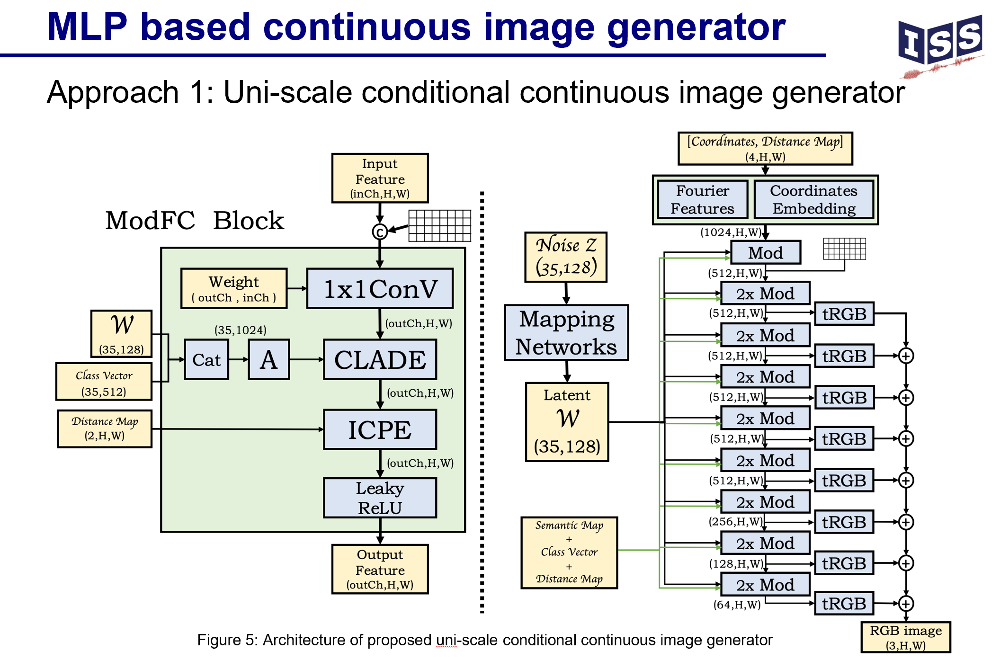
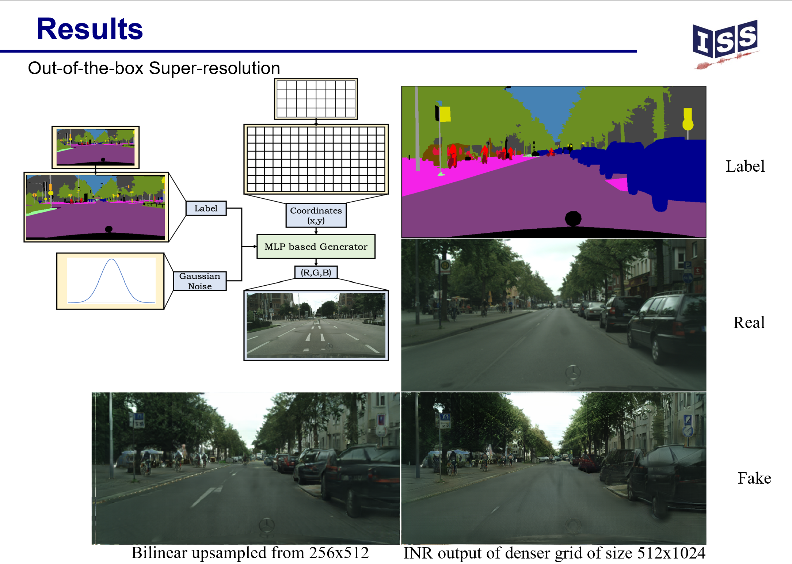
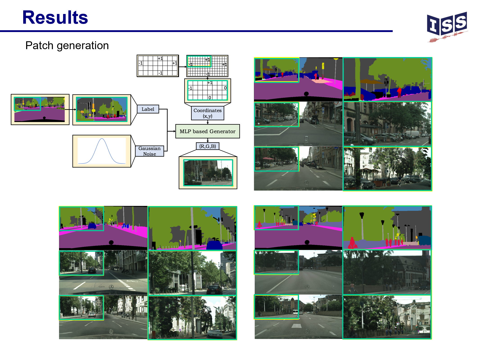
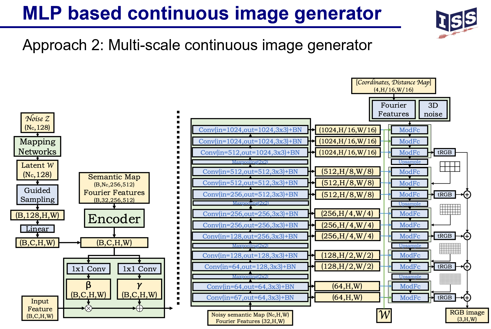
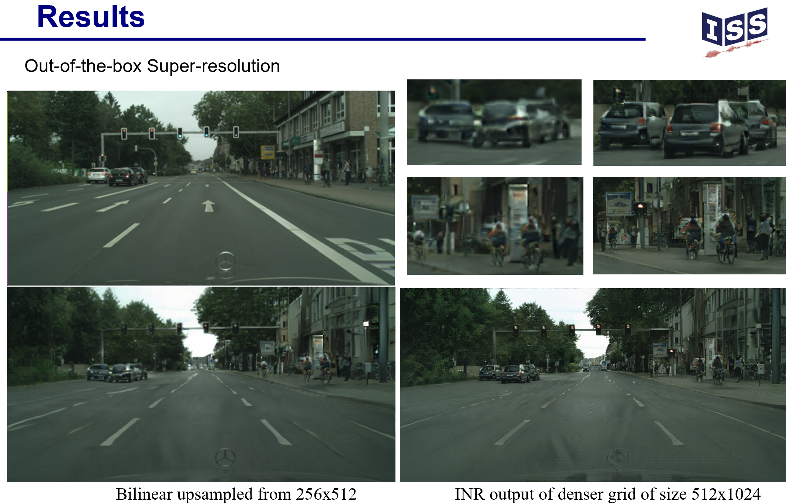
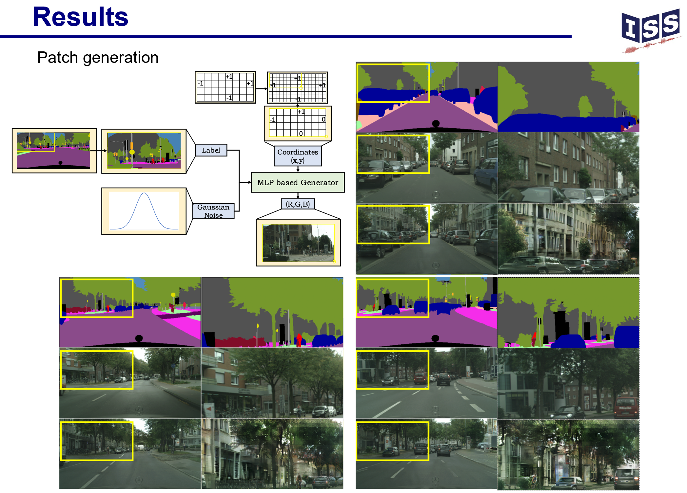
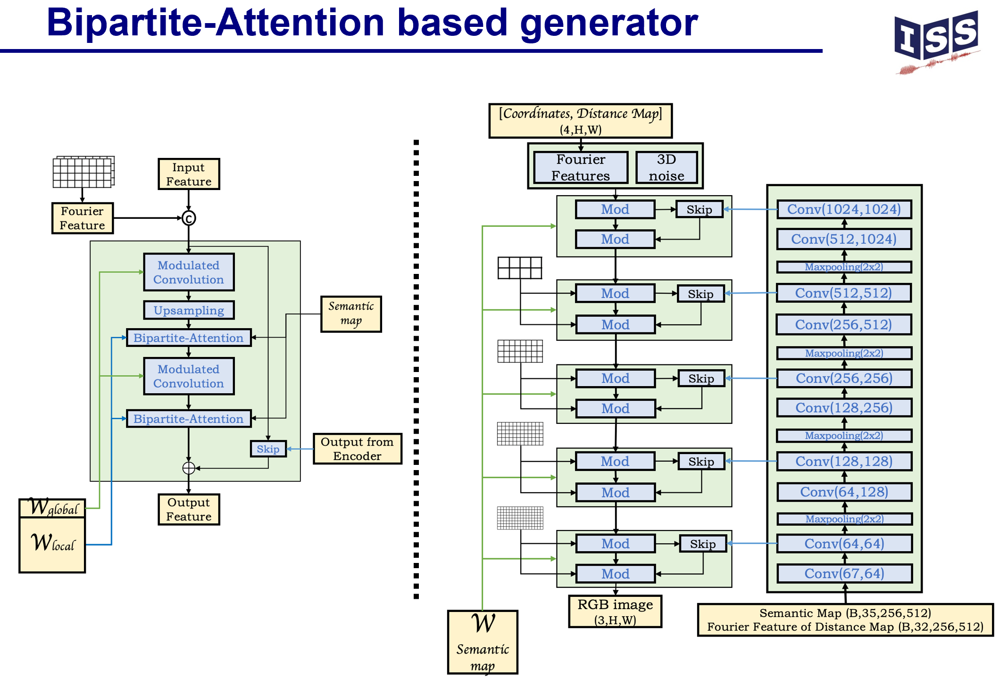

|                             |
|:-------------------------------------------------:|
|             **Universität Stuttgart**             |
| Institut für Signalverarbeitung und Systemtheorie |
|               Prof. Dr.-Ing. B. Yang              |
|                        |

# Research Project S1434

# Exploiting Transformers for Semantic Image Synthesis
## Student
| Name       | Haolin Jiang                     |
|------------|----------------------------------|
| Major      | Elektro- und Informationstechnik |
| Begin      | 20.11.2022                      |
| End        | 20.05.2023                       |
| Supervisor | George Basem Eskandar             |

## Abstract
This work presents an innovative exploration in the field of semantic image synthesis. We first leverage perceptron-based architectures to achieve pixel-independent generation of continuous images conditioned on semantic maps. Furthermore, this work extends and integrates the adaptive normalization layers with the bipartite attention mechanism to enhance the results of state-of-the-art (SOTA) models. The resultant system demonstrates significant performance, achieving SOTA Fréchet Inception Distance (FID) scores and high Mean Intersection over Union (MIoU) measures. Additionally, we introduce an innovative integration of the perceptual discriminator. Finally, we explore the adaptation of contrastive learning method for conditional semantic image generation.

please add the pretrained_models folder which contrains the drn-d-105_ms_cityscapes.pth to the directory skip_and_1spd/ and  choose to run following files:

The best result:
1.ganformer_oasisD.sh  (my generator with vanilla oasis discriminator)

others:
2.oasisG_epe.sh   (vanilla oasis generator with epe discriminator using pretrained oasis unet segmentation network)

3.ganformer_epe.sh  (my generator with epe discriminator using pretrained oasis unet segmentation network)
